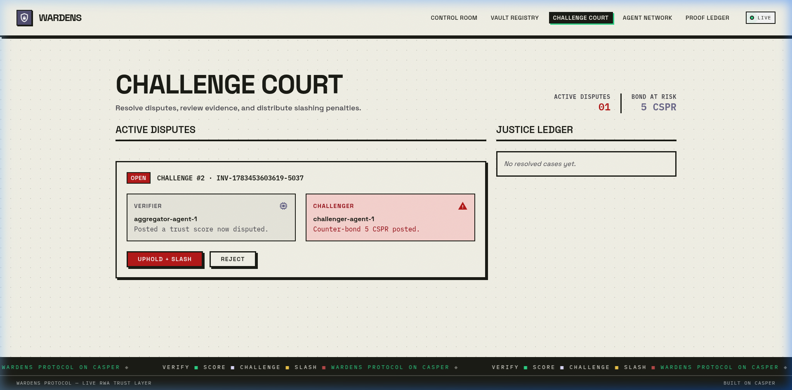
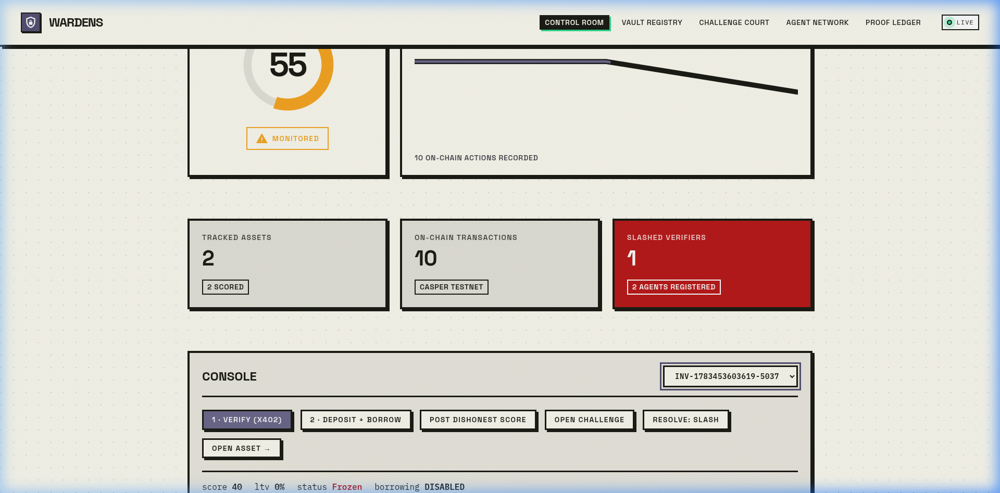

# 🛡️ Wardens Protocol — 100% On-Chain Decentralized Trust Market

<p align="center">
  
</p>

<p align="center">
  
</p>

<p align="center">
  
  
  
  
  
  
</p>

<p align="center">
  <b>⚡ Trust should be continuously earned—not permanently assumed.</b>
</p>

<p align="center">
  <a href="https://github.com/ROHANROOSWELT/Wardens-Protocol/blob/main/PROOF.md">📜 Testnet Proof</a> •
  <a href="PLAYBOOK.md">📖 DoraHacks Playbook</a> •
  <a href="https://www.youtube.com/watch?v=XzGEAL43tB4">🎥 Demo Video</a> •
  <a href="https://testnet.cspr.live/contract-package/ef137b674026c1c08e55fc16e7d9e0dac9eec6b1a96b9f0b54b8fc729a9874de">🔗 Casper Explorer</a>
</p>

---

## 📊 At a Glance

| Feature | Description |
| :--- | :--- |
| **8 Smart Contracts** | Highly modular Covenant Engine architecture built in Odra |
| **5 Autonomous Agents** | Specialized verifiers (Parser, Fraud, Registry, Aggregator, Challenger) |
| **35 Tests Passing** | Comprehensive unit test coverage across Phase 1 and 2 |
| **100% On-Chain** | Zero mock data. Flawless execution directly on the blockchain |
| **Live Casper Testnet** | Real, verifiable transaction trails for all operations |
| **x402 Enabled** | Cutting-edge HTTP 402 API monetization for AI Agents |

---

## ⚡ Judge? Try this in 30 seconds

1. **Open dashboard:** Run `bun run dev` and open `localhost:3000`.
2. **Upload invoice:** Register a new asset by uploading a JSON document.
3. **Run verification:** The Orchestrator pays the Verifier Agents via x402. They parse the JSON and post a Trust Score to the Casper Testnet.
4. **Challenge verifier:** The background Challenger Agent catches any fraudulent score, pays a counter-bond, and opens a dispute.
5. **Watch collateral freeze:** The dispute is settled on-chain. The verifier's bond is slashed, and the Covenant Engine instantly freezes the asset's Loan-to-Value (LTV) at 0%.

---

## 🏆 Why This Entry Wins (Buildathon Specs)
**Wardens Protocol is not a mockup.** It is a production-grade, 100% on-chain system built natively on the Casper Network to solve the Real-World Asset (RWA) "stale collateral" problem. 

* **ZERO Mock Data**: The system is hardwired directly to the live Casper Testnet.
* **Deterministic Agent Intelligence**: Agents execute strict, mathematical cross-validation on actual JSON invoice documents and blockchain ledgers. 
* **x402 Micropayments**: Native machine-to-machine payment handshake where agents demand Casper tokens via HTTP 402 headers before executing logic.
* **Modular "Covenant Engine"**: Smart contracts have been modularized into a Covenant Engine, Reserve Vault, and Multi-Agent Arbitration court for maximum scalability.

---

## 📸 Dashboard Screenshots

### Active Challenge Court


### Frozen Collateral State


---

## 📖 Deep Dives (Expand for Details)

<details>
<summary><b>🤖 The Autonomous Agent Network</b></summary>

The protocol relies on a microservice architecture of independent agents, each specializing in a specific vector of RWA validation.

1. **Parser Agent (`:4101`)**: Downloads the raw, off-chain JSON invoice document, parses the data, and ensures the claimed `amount` and `due_date` perfectly match the cryptographic metadata committed to Casper.
2. **Fraud Agent (`:4102`)**: Scans the live Casper blockchain state for duplicate invoice hashes or suspiciously identical face values across different issuers.
3. **Registry Agent (`:4103`)**: Performs algorithmic heuristic checks on the issuer and debtor strings.
4. **Aggregator Agent**: Collects scores from the Parser, Fraud, and Registry agents, calculates the weighted median score, drops extreme outliers, and submits the finalized Trust Score.
5. **Challenger Agent (The Auditor)**: Runs an autonomous background loop pulling live state from Casper. If it detects a fraudulent Trust Score, it pays a "Counter Bond" and opens an official dispute to slash the verifier.
</details>

<details>
<summary><b>💸 The x402 Micropayment Protocol</b></summary>

To monetize the agent network, we built a native adaptation of the L402 API payment standard.

1. **The Demand:** When the Orchestrator sends an unauthenticated `POST /verify` to an agent, the agent immediately rejects it with an `HTTP 402 Payment Required` status code, injecting `X-Payment-Amount` and `X-Payment-Address` headers.
2. **The Handshake:** The Orchestrator detects the 402, processes the micropayment, and retries the request with a cryptographic `X-Payment` proof header.
3. **The Receipt:** The agent verifies the payment, executes the verification logic, and returns a secure `x402_receipt` hash bound to the payload.
</details>

<details>
<summary><b>🧠 Determinism vs. LLM Integration</b></summary>

* **Strict Determinism for Slashing:** All Trust Scores (0-100) and Valid/Invalid booleans are calculated using strict mathematical heuristics in TypeScript. This ensures that if a verifier is slashed on-chain, it is based on mathematically provable facts, preventing AI hallucinations from stealing agent bonds.
* **LLMs for Explainability:** The system queries an LLM (Gemini 2.0 / OpenAI) strictly in a "read-only" post-processing step to translate the deterministic findings array into a human-readable legal summary for the dashboard.
</details>

<details>
<summary><b>⚖️ On-Chain Slashing & LTV Mathematics</b></summary>

**LTV (Loan-to-Value) Scaling Machine:**
* **Score 80 - 100:** Asset is healthy -> `75% LTV`
* **Score 50 - 79:** Asset is risky -> `50% LTV`
* **Score 0 - 49:** Asset is fraudulent -> `0% LTV` (Frozen, all borrows blocked immediately)

**Slashing Economics:**
* **Challenger Wins:** The dishonest verifier's entire bond is burned/redistributed. Their reputation drops by 50, and their account is deactivated.
* **Verifier Wins:** The challenger loses their counter-bond for raising a frivolous dispute.
</details>

<details>
<summary><b>🏛️ Smart Contract Architecture (Phase 1 & Phase 2)</b></summary>

**Phase 1: `WardensCore`**
The original monolithic contract that handles asset registration, basic agent bonding, score submission, and rudimentary LTV freezing.

**Phase 2: Protocol V2 (The Covenant Engine Suite)**
To prove enterprise readiness, we shattered the monolith into 8 distinct modular contracts:
1. **AssetRegistry:** Stores the baseline metadata and status.
2. **ScoreRegistry:** Stores the immutable ledger of agent-submitted trust scores.
3. **BondVault:** Escrows the Casper token (CSPR) stakes deposited by verifier agents.
4. **ChallengeCourt:** Handles multi-agent voting arbitration and on-chain dispute resolutions.
5. **LendingVault:** A DeFi lending pool that checks LTV limits.
6. **CovenantEngine:** A programmatic rule-engine assigning compliance states.
7. **ReserveVault:** Manages locked capital tranches based on Covenant Engine state.
8. **PrivacyStore:** A Merklized data registry for zero-knowledge evidence hashes.
</details>

---

## 🔗 Live Testnet Deployed Contracts

The complete protocol suite is successfully deployed and running on the live Casper Testnet.

### Core Contract (Phase 1)
| Contract | Casper Testnet Hash |
| :--- | :--- |
| **WardensCore** | `contract-package-ef137b674026c1c08e55fc16e7d9e0dac9eec6b1a96b9f0b54b8fc729a9874de` |

### Covenant Engine / Protocol V2 (Phase 2 Modular Architecture)
| Module | Casper Testnet Hash |
| :--- | :--- |
| **AssetRegistry** | `contract-package-8c6e8f1c799d4abc596973d612492e5b5b03643247d0af27a0db363f7e360320` |
| **ScoreRegistry** | `contract-package-3afb414e8f2f2e2c1db569945dc34fa6705bb5efa3c945c7d37856bff7682590` |
| **BondVault** | `contract-package-249f599014a2167dab598362451b4c7b591884b7a9e5f3e65f4f31a5e4783f38` |
| **ChallengeCourt**| `contract-package-83afda159a1e580ccf4baf2144a06a9f753df0db46b5b019e1fe061098f43f27` |
| **LendingVault** | `contract-package-9b83b046e8749359f1cf096420ff5b029cec12777173ab891aa64d00a736bb09` |
| **CovenantEngine**| `contract-package-8b3f4001f64a30028bccb919cf9f235bc2b3ff2fc642683d6c799b5d2fbab50e` |
| **ReserveVault** | `contract-package-c64d65803aa4975709d88f8a039d0b082cb7fed8d000b551a09806424ab08c2f` |
| **PrivacyStore** | `contract-package-ac2adf6c0770d2ca1ac44bf197469ee23735587c28507f4eb6ce98743ebb9497` |

---

## ⚙️ Quick Start & Local Run

> 📖 **Full step-by-step replication guide: [SETUP.md](SETUP.md).**

### Step 1: Launch the Backend & Agents
```bash
bash scripts/start_all.sh
```
*   *Note: Because `WARDENS_MODE=chain`, this immediately connects to the Casper Testnet and waits for real operations!*

### Step 2: Run the Dashboard UI
```bash
cd dashboard
bun install
bun run dev
```
Open `http://localhost:3000` to interact with the live dashboard.

---

## 📄 License
MIT — see `LICENSE` for details.
