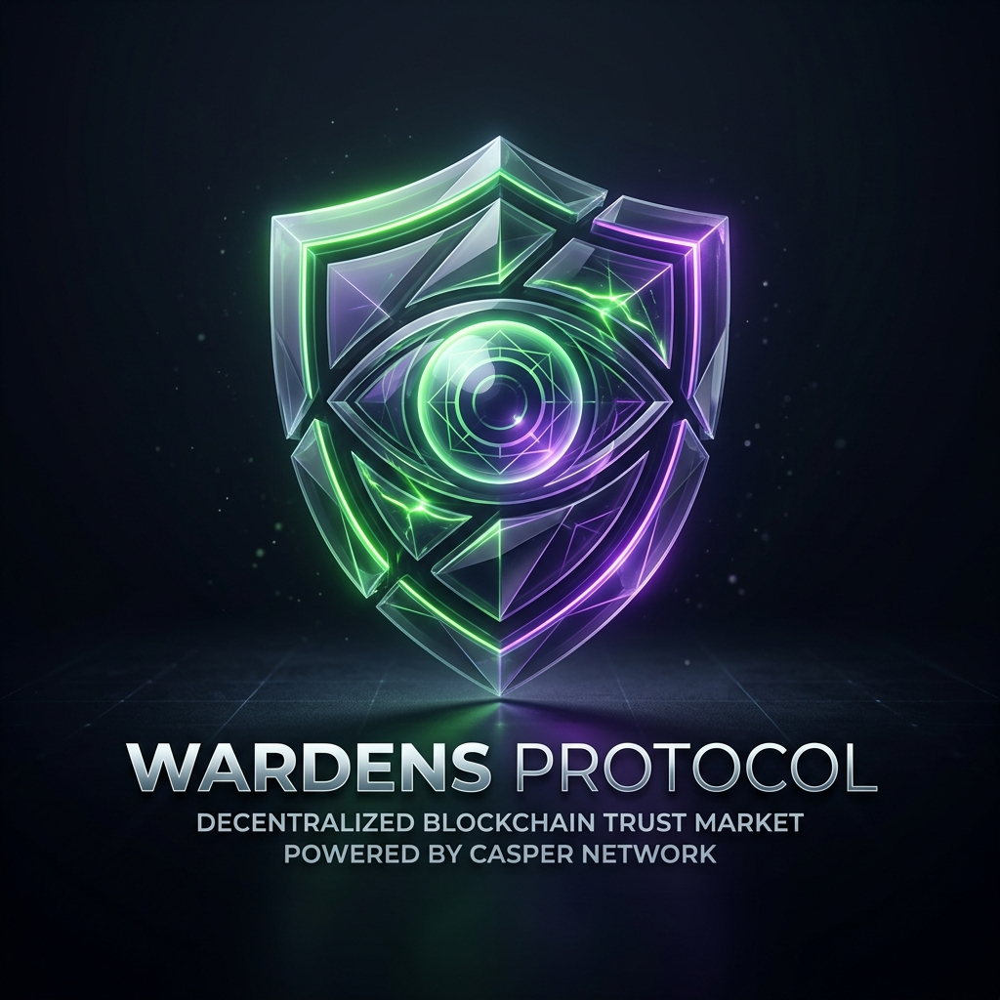
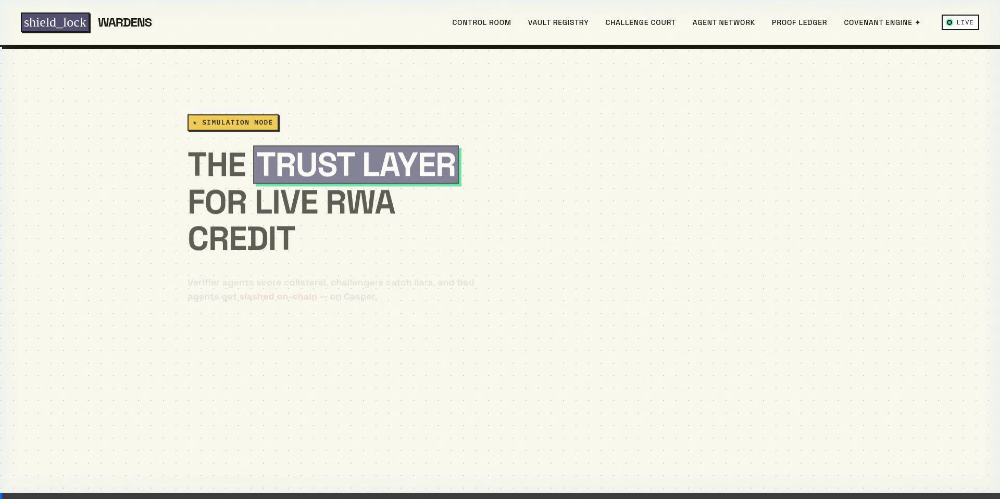
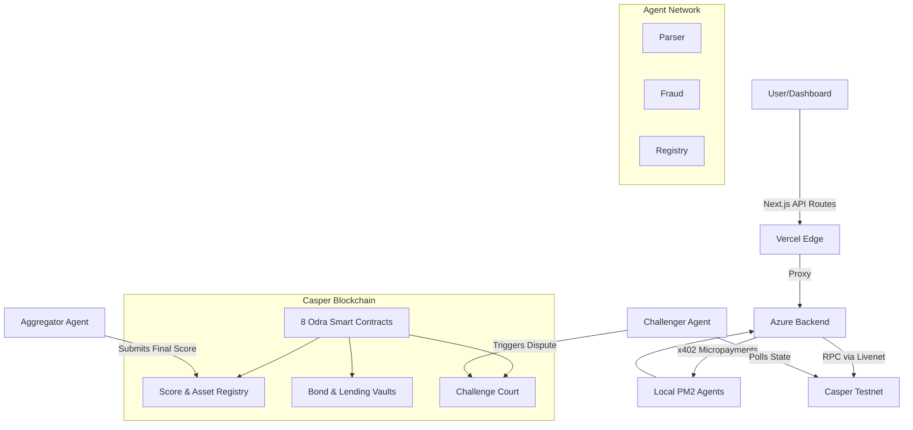

<div align="center">
  
  
  # Wardens Protocol
  
  <b>⚡ Trust should be continuously earned—not permanently assumed. ⚡</b>
  
  <br />
  
  
  
  <br /><br />
  
  
  
  
  
  
  

  <br />

  <a href="https://wardens-protocol.vercel.app">🌍 Live Demo</a> •
  <a href="https://github.com/ROHANROOSWELT/Wardens-Protocol/blob/main/PROOF.md">📜 Testnet Proof</a> •
  <a href="https://www.youtube.com/watch?v=XzGEAL43tB4">🎥 Demo Video</a>
</div>

---

## 📑 Table of Contents
- [Protocol Statistics](#-protocol-statistics)
- [Why Wardens Protocol Matters](#-why-wardens-protocol-matters)
- [Why Casper?](#-why-casper)
- [Quick Demo Flow](#-quick-demo-flow)
- [System Architecture](#-system-architecture)
- [Smart Contract Architecture](#-smart-contract-architecture)
- [The Autonomous Agent Network](#-the-autonomous-agent-network)
- [Live Testnet Deployed Contracts](#-live-testnet-deployed-contracts)
- [Installation & Local Setup](#️-installation--local-setup)
- [Next Milestones](#-next-milestones)

---

## 📊 Protocol Statistics

- ✓ **8** Smart Contracts
- ✓ **5** Autonomous Agents
- ✓ **100%** On-chain Scoring
- ✓ **9** Casper Deployments
- ✓ **Azure** Deployment
- ✓ **Vercel** Frontend
- ✓ **x402** Integration
- ✓ **Rust + Odra** Built

---

## 💡 Why Wardens Protocol Matters

Traditional Real-World Asset (RWA) lending assumes collateral remains trustworthy after onboarding. If a physical asset degrades or an invoice defaults weeks later, the smart contract has no idea. **The collateral becomes stale, creating systemic risk.**

Wardens replaces that assumption with a **decentralized verification economy** where agents continuously monitor assets, challenge dishonest reports, and enforce protocol rules entirely on-chain. Instead of trusting one oracle forever, the protocol creates economic incentives for truthful verification in real-time.

---

## 🔴 Why Casper?

Wardens requires deterministic execution, upgradeable contracts, predictable gas, and modular protocol evolution. 

Casper’s upgradeable contract packages, the Odra framework, and native contract versioning allow our Covenant Engine modules to evolve independently while preserving critical on-chain state. It is the perfect layer-1 for an enterprise-grade trust protocol.

---

## 🚀 Quick Demo Flow

<div align="center">
  
</div>

1. **Upload Invoice:** Submit a JSON payload to register a new asset.
2. **Agents Verify:** The backend pays agents via x402 micropayments to parse data.
3. **Score Submitted:** Agents post a Trust Score (0-100) on-chain.
4. **Challenge Opens:** The Challenger Agent catches fraudulent scores and opens a dispute.
5. **Arbitration Vote:** Bonded agents vote on the dispute on-chain.
6. **Slash & Freeze:** The dishonest verifier's bond is slashed, and the collateral's Loan-to-Value (LTV) drops to 0%.

---

## 🏛️ System Architecture



---

## 📜 Smart Contract Architecture

Built using the **Odra Framework**, we modularized the protocol into 8 upgradeable contracts:

- **AssetRegistry & ScoreRegistry:** Tokenizes RWA metadata and stores the immutable ledger of agent-submitted trust scores.
- **BondVault & LendingVault:** Escrows Casper token (CSPR) agent stakes and algorithmically enforces DeFi LTV limits based on Trust Scores.
- **ChallengeCourt:** Handles multi-agent voting arbitration and on-chain dispute resolutions.
- **CovenantEngine & ReserveVault:** A programmatic rule-engine assigning compliance states (Full Access, Frozen, etc.) and managing locked capital tranches.
- **PrivacyStore:** A Merklized data registry for zero-knowledge evidence hashes.

---

## 🤖 The Autonomous Agent Network

Our network of deterministic verifier agents operates as independent Node.js microservices via PM2 on Azure. To save gas, internal data-fetchers run off-chain, while only public actors lock up cryptographic bonds on the Casper blockchain.

- **Parser / Fraud / Registry Agents:** Internal microservices that parse JSON invoices, scan blockchain state for duplicate hashes, and run algorithmic heuristic checks on debtor credentials.
- **Aggregator Agent (On-Chain Verifier):** Collects internal scores, drops extreme outliers, and submits the finalized Trust Score to Casper.
- **Challenger Agent (On-Chain Auditor):** An autonomous cron job polling the blockchain. If it detects fraud, it pays a "Counter Bond" and interacts with the `ChallengeCourt` contract to slash the aggregator.

---

## 🔗 Live Testnet Deployed Contracts

<details>
<summary><b>Click to view all 9 Casper Testnet Hashes</b></summary>
<br>

| Module | Casper Testnet Hash |
| :--- | :--- |
| **WardensCore (Phase 1)** | `contract-package-ef137b674026c1c08e55fc16e7d9e0dac9eec6b1a96b9f0b54b8fc729a9874de` |
| **AssetRegistry** | `contract-package-8c6e8f1c799d4abc596973d612492e5b5b03643247d0af27a0db363f7e360320` |
| **ScoreRegistry** | `contract-package-3afb414e8f2f2e2c1db569945dc34fa6705bb5efa3c945c7d37856bff7682590` |
| **BondVault** | `contract-package-249f599014a2167dab598362451b4c7b591884b7a9e5f3e65f4f31a5e4783f38` |
| **ChallengeCourt**| `contract-package-83afda159a1e580ccf4baf2144a06a9f753df0db46b5b019e1fe061098f43f27` |
| **LendingVault** | `contract-package-9b83b046e8749359f1cf096420ff5b029cec12777173ab891aa64d00a736bb09` |
| **CovenantEngine**| `contract-package-8b3f4001f64a30028bccb919cf9f235bc2b3ff2fc642683d6c799b5d2fbab50e` |
| **ReserveVault** | `contract-package-c64d65803aa4975709d88f8a039d0b082cb7fed8d000b551a09806424ab08c2f` |
| **PrivacyStore** | `contract-package-ac2adf6c0770d2ca1ac44bf197469ee23735587c28507f4eb6ce98743ebb9497` |

</details>

---

## 📂 Repository Structure

```text
├── agents/                 # Autonomous Node.js microservices (Parser, Fraud, etc.)
├── backend/                # Express.js orchestrator (PM2 entrypoint)
├── contracts/              # Rust smart contracts using Odra Framework
│   ├── wardens_core/       # Phase 1 Monolithic contract
│   └── wardens_phase2/     # Phase 2 Modular Covenant Engine (8 contracts)
├── dashboard/              # Next.js 15 UI frontend
├── scripts/                # Deployment and orchestration scripts
├── ecosystem.config.js     # PM2 daemon configuration
└── README.md
```

---

## 🛠️ Installation & Local Setup

### 1. Clone & Build Contracts
*Requires Rust and Cargo.*
```bash
git clone https://github.com/ROHANROOSWELT/Wardens-Protocol.git
cd Wardens-Protocol/contracts/wardens_core
cargo build --release --features livenet --bin wardens_livenet

cd ../wardens_phase2
cargo build --release --features livenet --bin wardens_phase2_livenet
```

### 2. Start the Backend and Agents
*Requires [Bun](https://bun.sh/) and [PM2](https://pm2.keymetrics.io/).*
```bash
cd ../../backend
bun install
cd ..
pm2 start ecosystem.config.js
```

### 3. Run the Dashboard
```bash
cd dashboard
bun install
bun run dev
```

---

## 🗺️ Next Milestones

- 🌐 **Mainnet** — Deploying the Covenant Engine to Casper Mainnet.
- 🔐 **ZK Evidence** — Zero-Knowledge proofs for private invoice verification.
- 🏛️ **DAO Governance** — Decentralized updates for Covenant Engine rules.
- 🌉 **Cross-chain Verification** — Bridging asset states across networks.

---

## 📄 License
MIT — see `LICENSE` for details.
