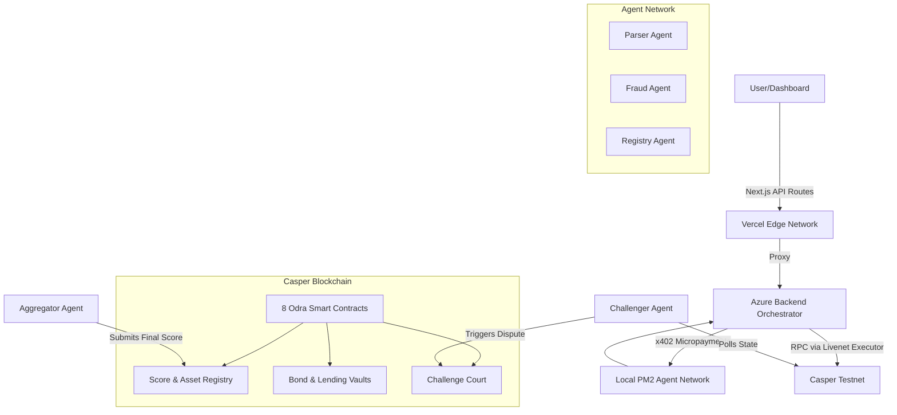

# 🛡️ Wardens Protocol — The 100% On-Chain Decentralized Trust Market

<p align="center">
  
  
  
  
  
  
</p>

<p align="center">
  <b>⚡ Trust should be continuously earned—not permanently assumed.</b>
</p>

<p align="center">
  <a href="https://wardens-protocol.vercel.app">🌍 Live Demo</a> •
  <a href="https://github.com/ROHANROOSWELT/Wardens-Protocol/blob/main/PROOF.md">📜 Testnet Proof</a> •
  <a href="https://www.youtube.com/watch?v=XzGEAL43tB4">🎥 Demo Video</a>
</p>

---

## 🏆 The Vision: Solving the "Stale Collateral" Crisis
In traditional Decentralized Finance (DeFi) and Real-World Asset (RWA) lending, collateral is checked once during onboarding and then largely ignored. If an invoice defaults, a shipping container sinks, or a physical asset degrades, the on-chain smart contract has no idea. **The collateral becomes stale, creating systemic risk.**

**Wardens Protocol** is a 100% on-chain decentralized oracle network built natively on the Casper Network. It replaces static collateral with a continuous market of autonomous AI and deterministic verifier agents that monitor, score, and challenge RWA collateral in real-time.

---

## 🚀 Quick Demo Flow

To see the system in action, follow these steps on the [Live Dashboard](https://wardens-protocol.vercel.app):

1. **Upload RWA Invoice:** Submit a JSON invoice payload to register a new asset.
2. **Agents Verify (x402):** The backend pays verifier agents via x402 micropayments to parse the payload.
3. **Score Submitted:** Agents post a deterministic Trust Score (0-100) on-chain.
4. **Challenge Opens:** The background Challenger Agent catches fraudulent scores and opens a dispute.
5. **Arbitration Vote:** Other bonded agents vote on the dispute on-chain.
6. **Slash & Freeze:** The dishonest verifier's bond is slashed, and the collateral's Loan-to-Value (LTV) is frozen.

---

## 🏛️ System Architecture

The protocol features a hybrid deployment model utilizing Edge rendering, Azure orchestration, and Casper smart contracts.



---

## 📊 At a Glance (The Tech Stack)

| Feature | Description |
| :--- | :--- |
| **100% ON-CHAIN** | Zero mocked endpoints. RWA scores, agent bonds, and arbitration votes are real cryptographic deploys on the Casper Testnet. |
| **8 Smart Contracts** | Modular "Covenant Engine" architecture built strictly in Rust using the Odra Framework. |
| **5 Autonomous Agents** | Specialized microservices executing parallel verification logic (Parser, Fraud, Registry, Aggregator, Challenger). |
| **x402 Micropayments** | Native HTTP 402 API monetization. Agents demand cryptographic micropayment proofs before executing validation. |
| **Deployment** | Fully deployed across the Casper Testnet, Microsoft Azure (Backend & PM2 agents), and Vercel (Frontend). |

---

## 📂 Repository Structure

```text
├── agents/                 # Autonomous Node.js microservices (Parser, Fraud, etc.)
├── backend/                # Express.js orchestrator (PM2 entrypoint)
├── contracts/              # Rust smart contracts using Odra Framework
│   ├── wardens_core/       # Phase 1 Monolithic contract
│   └── wardens_phase2/     # Phase 2 Modular Covenant Engine (8 contracts)
├── dashboard/              # Next.js 15 UI frontend
├── scripts/                # Deployment and orchestration scripts
├── ecosystem.config.js     # PM2 daemon configuration
└── README.md
```

---

## ⚙️ How It Works (The 100% On-Chain Flow)

1. **Verify (x402 Handshake):** An RWA issuer uploads an invoice. The Backend Orchestrator initiates an unauthenticated request to the verifier agents. The agents reply with an `HTTP 402 Payment Required`. The Orchestrator processes the micropayment, receives an `x402_receipt`, and the agents parse the metadata.
2. **Score (Casper Smart Contracts):** Agents execute strict deterministic heuristics to validate the asset. The final Trust Score (0-100) is submitted directly to the `ScoreRegistry` smart contract. 
3. **Challenge (Arbitration Court):** A background "Challenger Agent" continuously polls state from the blockchain. If it detects a fraudulent score, it pays a "Counter Bond" and opens an on-chain dispute in the `ChallengeCourt`. 
4. **Slash & Freeze (Covenant Engine):** Other registered agents cast their votes on-chain. If the verifier is proven wrong, its bonded CSPR is permanently slashed, and the `CovenantEngine` instantly drops the asset's Loan-to-Value (LTV) to 0%, freezing the vault.

---

## 📜 Smart Contract Architecture (Phase 1 & Phase 2)

We built a dual-phase contract suite using the **Odra Framework** for Casper.

### Phase 1: `WardensCore`
The original monolithic contract that handles end-to-end asset registration, basic agent bonding, score submission, and rudimentary LTV freezing.

### Phase 2: Protocol V2 (The Covenant Engine Suite)
To support modular upgrades, the monolith was refactored into **8 distinct contracts**:
1. **AssetRegistry:** Tokenizes RWA metadata and baseline status.
2. **ScoreRegistry:** Stores the immutable ledger of agent-submitted trust scores.
3. **BondVault:** Escrows the Casper token (CSPR) stakes deposited by verifier agents.
4. **ChallengeCourt:** Handles multi-agent voting arbitration and on-chain dispute resolutions.
5. **LendingVault:** A DeFi lending pool that algorithmically enforces LTV limits based on Trust Scores.
6. **CovenantEngine:** A programmatic rule-engine assigning compliance states (Full Access, Monitored, Draws Frozen, Breach Mode).
7. **ReserveVault:** Manages locked capital tranches released only when Covenant Engine state allows.
8. **PrivacyStore:** A Merklized data registry for zero-knowledge evidence hashes.

---

## 🤖 The Autonomous Agent Network

The protocol relies on a microservice architecture of independent Node.js agents. We employ a **Hybrid Registry Strategy**: all 5 agents run continuously via PM2 on Azure, but only the public actors (Aggregator and Challenger) lock up public cryptographic bonds on the Casper blockchain to save gas.

1. **Parser Agent (`:4101`)**: Parses the JSON invoice to ensure claimed `amount` and `due_date` match the cryptographic metadata.
2. **Fraud Agent (`:4102`)**: Scans live blockchain state for duplicate invoice hashes or suspicious face values.
3. **Registry Agent (`:4103`)**: Performs algorithmic heuristic checks on issuer and debtor credentials.
4. **Aggregator Agent (On-Chain Verifier)**: Collects scores, drops extreme outliers, and submits the finalized Trust Score to Casper.
5. **Challenger Agent (On-Chain Auditor)**: An autonomous cron job that audits scores. If it detects fraud, it interacts with the `ChallengeCourt` contract to slash the aggregator.

---

## 🔗 Live Testnet Deployed Contracts

The complete protocol suite is successfully deployed on the live Casper Testnet.

### Covenant Engine / Protocol V2 (Phase 2 Modular Architecture)
| Module | Casper Testnet Hash |
| :--- | :--- |
| **AssetRegistry** | `contract-package-8c6e8f1c799d4abc596973d612492e5b5b03643247d0af27a0db363f7e360320` |
| **ScoreRegistry** | `contract-package-3afb414e8f2f2e2c1db569945dc34fa6705bb5efa3c945c7d37856bff7682590` |
| **BondVault** | `contract-package-249f599014a2167dab598362451b4c7b591884b7a9e5f3e65f4f31a5e4783f38` |
| **ChallengeCourt**| `contract-package-83afda159a1e580ccf4baf2144a06a9f753df0db46b5b019e1fe061098f43f27` |
| **LendingVault** | `contract-package-9b83b046e8749359f1cf096420ff5b029cec12777173ab891aa64d00a736bb09` |
| **CovenantEngine**| `contract-package-8b3f4001f64a30028bccb919cf9f235bc2b3ff2fc642683d6c799b5d2fbab50e` |
| **ReserveVault** | `contract-package-c64d65803aa4975709d88f8a039d0b082cb7fed8d000b551a09806424ab08c2f` |
| **PrivacyStore** | `contract-package-ac2adf6c0770d2ca1ac44bf197469ee23735587c28507f4eb6ce98743ebb9497` |

### Core Contract (Phase 1)
| Contract | Casper Testnet Hash |
| :--- | :--- |
| **WardensCore** | `contract-package-ef137b674026c1c08e55fc16e7d9e0dac9eec6b1a96b9f0b54b8fc729a9874de` |

---

## 🛠️ Installation & Local Setup

### 1. Clone the Repository
```bash
git clone https://github.com/ROHANROOSWELT/Wardens-Protocol.git
cd Wardens-Protocol
```

### 2. Build the Rust Smart Contracts
*Requires Rust and Cargo to be installed.*
```bash
cd contracts/wardens_core
cargo build --release --features livenet --bin wardens_livenet

cd ../wardens_phase2
cargo build --release --features livenet --bin wardens_phase2_livenet
```

### 3. Start the Backend and Agents
*Requires [Bun](https://bun.sh/) and [PM2](https://pm2.keymetrics.io/).*
```bash
cd backend
bun install
cd ..

# Start the orchestrator and all agents via PM2
pm2 start ecosystem.config.js
```

### 4. Run the Dashboard
```bash
cd dashboard
bun install
bun run dev
```
Open `http://localhost:3000` to interact with the local dashboard.

---

## 🗺️ Roadmap

- **Q4 2026:** Casper Mainnet Deployment.
- **Q1 2027:** Zero-Knowledge (ZK) Proof integration for private invoice verification.
- **Q2 2027:** Integration with major real-world Oracle providers (Chainlink, Pyth).
- **Q3 2027:** Decentralized DAO governance for updating Covenant Engine rules.
- **Q4 2027:** Multi-chain bridging and support.

---

## 📄 License
MIT — see `LICENSE` for details.
