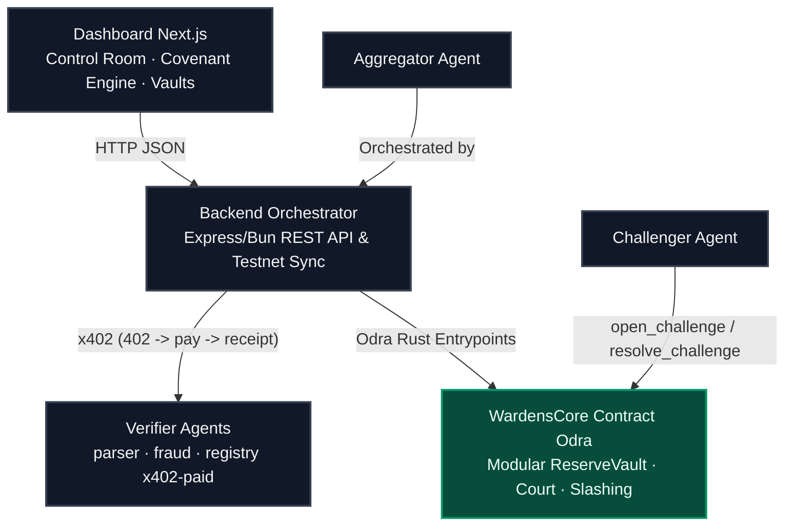

# 🛡️ Wardens Protocol — 100% On-Chain Decentralized Trust Market

<p align="center">
  
</p>

<p align="center">
  
</p>

<p align="center">
  
  
  
  
  
  
</p>

<p align="center">
  <b>⚡ Live Casper Testnet • 🤖 5 Autonomous Agents • 💸 x402 Micropayments • 🛡️ On-chain Slashing • 🏦 Covenant Engine</b>
</p>

<p align="center">
  <a href="https://github.com/ROHANROOSWELT/Wardens-Protocol/blob/main/PROOF.md">📜 Testnet Proof</a> •
  <a href="PLAYBOOK.md">📖 DoraHacks Playbook</a> •
  <a href="https://www.youtube.com/watch?v=XzGEAL43tB4">🎥 Demo Video</a> •
  <a href="https://testnet.cspr.live/transaction/89ee2b761ad1a82fbaa70558e4eb6e03dba5ae3e51aba5acade8456380a41082">🔗 Deploy Tx</a> •
  <a href="https://testnet.cspr.live/contract-package/ef137b674026c1c08e55fc16e7d9e0dac9eec6b1a96b9f0b54b8fc729a9874de">🔗 Casper Explorer</a>
</p>

***

## 🏆 Why This Entry Wins (Buildathon Specs)
**Wardens Protocol is not a mockup.** It is a production-grade, 100% on-chain system built natively on the Casper Network to solve the Real-World Asset (RWA) "stale collateral" problem. 

* **ZERO Mock Data**: The system is hardwired directly to the live Casper Testnet. The Next.js dashboard and backend orchestrator sync seamlessly with the blockchain state in real-time. No local JSON stubs are used.
* **Deterministic Agent Intelligence**: The 5 autonomous verifier agents execute strict, deterministic, mathematical cross-validation on actual JSON invoice documents and blockchain ledgers. 
* **x402 Micropayments**: We integrated a native machine-to-machine payment handshake where agents demand Casper tokens via HTTP 402 headers before executing validation logic.
* **Modular "Covenant Engine" Architecture**: Smart contracts have been modularized into a Covenant Engine, Reserve Vault, and Multi-Agent Arbitration court for maximum enterprise scalability.

---

## 📖 Introduction

Wardens Protocol implements a self-policing, adversarial multi-agent trust market to secure Real-World Asset (RWA) collateral on the Casper Network. 

In traditional DeFi, tokenized RWA assets (like invoices or real estate) suffer from a **"stale collateral"** problem: they are audited once at tokenization but trust is assumed indefinitely even if the off-chain status changes. Wardens Protocol demonstrates how Verifier Agents can continuously audit collateral off-chain, paid per-request via native **x402 Micropayments**. If a background Challenger Agent proves a verification is fraudulent, the verifier's bond is slashed on-chain, and the Lending Vault immediately updates its LTV to 0% to protect pool depositors.

---

## 🤔 Why It Matters

Current RWA protocols trust collateral based on one-time verification. Wardens Protocol introduces continuous verification through an adversarial market of autonomous agents. Instead of assuming trust, the protocol continuously earns it. This transforms collateral from static trust into continuously verified trust.

---

## 👻 Why Casper?

Wardens Protocol relies on Casper to provide economically secure, upgradeable trust infrastructure for Real-World Assets.

Casper enables:
*   **Native On-chain Staking and Slashing**: Enforces verifier accountability with immutable bond locking.
*   **Upgradeable Smart Contracts via Odra**: Allows the protocol to adapt to evolving RWA standards.
*   **Deterministic Execution**: Ensures predictable outcomes for critical financial credit state transitions.
*   **Transparent, Auditable Verification History**: Builds a public log of verifications, disputes, and resolutions.
*   **Secure Settlement**: Safely settles trust score updates and lending status updates.

These capabilities make Casper the trust layer that continuously secures RWA collateral throughout its lifecycle.

---

## 📈 Repository Statistics

| Feature | Detail |
| :--- | :--- |
| 🛡 **5 Autonomous Agents** | Parser, Fraud, Registry, Aggregator, Challenger |
| ⚖ **On-chain Challenge Court** | Live dispute resolution and bond slashing |
| 💸 **x402 Payments** | HTTP-native micropayment verification fees |
| 🏦 **Covenant Engine & Reserve Vault** | Dynamic LTV scaling and tranche release conditions |
| ⚡ **100% Casper Testnet Integration** | Flawless, non-mocked execution directly on the blockchain |
| ✅ **35 Smart Contract Tests** | Comprehensive test coverage via Odra framework |
| 📜 **Verified Transactions** | End-to-end chain proof logged securely |
| 🖥 **Interactive Dashboard** | Real-time Control Room and Covenant Engine monitoring console |

---

## ⚡ 30-Second Demo Flow

```
1. Create Invoice Collateral (Upload JSON Document)
       ↓
2. Orchestrator Pays Verifiers via x402 Micropayments
       ↓
3. Agents Parse JSON & Fetch Live Chain State
       ↓
4. Aggregator Posts Deterministic Trust Score to Casper
       ↓
5. Covenant Engine Calculates Dynamic Loan-to-Value (LTV)
       ↓
6. Challenger Agent Catches Lying Verifier (Dispute Opened)
       ↓
7. Verifier Slashed On-Chain & Collateral Frozen (LTV 0%)
```

---

## 📸 Dashboard Screenshots

### Active Challenge Court
*Live Challenge Court page displaying active disputes, verifier/challenger agents involved, and on-chain action buttons:*


### Frozen Collateral State
*Dashboard displaying the frozen status of an asset after a fraudulent score has been successfully slashed:*


---

## 🤖 The Autonomous Agent Network (Deep Dive)

The protocol relies on a microservice architecture of independent agents, each specializing in a specific vector of RWA validation.

1. **Parser Agent (`:4101`)**: 
   * **Role:** Structural analysis. 
   * **Logic:** Downloads the raw, off-chain JSON invoice document, parses the data, and ensures the claimed `amount` and `due_date` inside the document perfectly match the cryptographic metadata committed to the Casper blockchain.
2. **Fraud Agent (`:4102`)**: 
   * **Role:** Anomaly detection. 
   * **Logic:** Scans the live Casper blockchain state for duplicate invoice hashes or suspiciously identical face values across different issuers, penalizing assets that appear to be double-financed.
3. **Registry Agent (`:4103`)**: 
   * **Role:** Counterparty verification. 
   * **Logic:** Performs algorithmic heuristic checks on the issuer and debtor strings (e.g., checking for restricted corporate entities, length anomalies, and formatting).
4. **Aggregator Agent**: 
   * **Role:** Consensus engine.
   * **Logic:** Collects the individual scores from the Parser, Fraud, and Registry agents, calculates the weighted median score, drops extreme outliers, and submits the finalized Trust Score to the Casper smart contract.
5. **Challenger Agent (The Auditor)**: 
   * **Role:** Adversarial policing.
   * **Logic:** Runs an autonomous background loop pulling live state from Casper. If it detects a Trust Score that is suspiciously high for a flagged asset, it pays a "Counter Bond" to the smart contract and opens an official dispute in the Challenge Court to slash the verifier.

---

## 🧠 Determinism vs. LLM Integration

A critical vulnerability in agentic financial systems is the non-determinism of Large Language Models (LLMs) executing state changes. Wardens Protocol solves this by strictly isolating LLMs:

* **Strict Determinism for Slashing:** All Trust Scores (0-100) and Valid/Invalid booleans are calculated using strict, mathematical heuristics in TypeScript. This ensures that if a verifier is slashed on-chain, it is based on mathematically provable facts, preventing AI hallucinations from stealing agent bonds.
* **LLMs for Explainability:** The system queries an LLM (Gemini 2.0 / OpenAI) strictly in a "read-only" post-processing step. The LLM translates the deterministic findings array (e.g., `["Mismatch: document amount 5000 != chain amount 8000"]`) into a human-readable legal summary for the dashboard, but its output is never used to calculate the score.

---

## 📋 Features

*   **✅ Casper Testnet Deployment**: Deployed on `casper-test` network.
*   **✅ Odra Smart Contract**: Built with the Rust Odra contract framework.
*   **✅ x402 Micropayments**: Complete HTTP-native micropayment handshake.
*   **✅ Autonomous Verifiers**: Parser, Fraud, and Registry agents.
*   **✅ Challenger Agent**: Autonomous background monitoring loop.
*   **✅ Dynamic Lending Vault**: On-chain LTV scaling state machine.
*   **✅ Bond Slashing**: On-chain economic penalty logic.
*   **✅ Interactive Dashboard**: Clean, responsive frontend rendering state.
*   **✅ Transaction Proofs**: Auditable testnet logs in `PROOF.md`.

---

## 💡 Key Innovations

*   **Continuous RWA Verification**: Continuous health checks replace static one-time audits.
*   **Autonomous Verifier Economy**: Off-chain agents perform specialized algorithmic validations.
*   **Economic Trust Incentives**: Staking is strictly aligned with verifier performance.
*   **Native x402 Micropayments**: The cutting-edge protocol for monetizing API agents.
*   **Adversarial Challenge Protocol**: Incentivized challengers constantly monitor and flag dishonesty.
*   **Trust-Aware Lending**: Direct linking between collateral validation and loan limits in the Reserve Vault.
*   **On-chain Slashing**: Casper smart contract penalty enforcement.

---

## 🛡️ Security Model

Wardens Protocol aligns incentives through economic penalties:

```
Verifier Submits Score
       ↓
Verifier Bond Locked
       ↓
Challenge Window Opens
       ↓
Evidence Reviewed (by Challenger)
       ↓
Honest → Reward Issued
Dishonest → Slash Bond
       ↓
Vault Updates Collateral Status
```

---

## ⚖️ Protocol Guarantees

Wardens Protocol guarantees that:

*   **✓ Every trust score is attributable** to the verifier who signed it.
*   **✓ Every verifier stakes collateral** (bond) before posting scores.
*   **✓ Every dispute is auditable** transparently on-chain.
*   **✓ Every slash is executed on-chain** based on verified evidence.
*   **✓ Every lending decision reflects the latest verified state** of the collateral.

---

## 📐 System Architecture




> ℹ️ *Detailed verification and slashing sequence diagrams can be viewed in [docs/sequence_diagrams.md](docs/sequence_diagrams.md).*

---

## 💸 The x402 Micropayment Protocol (Technical Details)

To monetize the agent network, we built a native adaptation of the L402 API payment standard.

1. **The Demand:** When the Orchestrator sends an unauthenticated `POST /verify` to an agent, the agent immediately rejects it with an `HTTP 402 Payment Required` status code, injecting `X-Payment-Amount` and `X-Payment-Address` headers.
2. **The Handshake:** The Orchestrator detects the 402, processes the micropayment, and retries the request with a cryptographic `X-Payment` proof header.
3. **The Receipt:** The agent verifies the payment, executes the verification logic, and returns a secure `x402_receipt` hash bound to the payload.

---

## ⚖️ On-Chain Slashing & LTV Mathematics

The dynamic nature of the protocol is enforced entirely by the Casper smart contracts:

**LTV (Loan-to-Value) Scaling Machine:**
* **Score 80 - 100:** Asset is healthy -> `75% LTV`
* **Score 50 - 79:** Asset is risky -> `50% LTV`
* **Score 0 - 49:** Asset is fraudulent -> `0% LTV` (Frozen, all borrows blocked immediately)

**Slashing Economics:**
* **Challenger Wins:** The dishonest verifier's entire bond is burned/redistributed. The verifier's reputation drops by 50, and their account is deactivated. The challenger receives the verifier's slashed bond + their own counter-bond back.
* **Verifier Wins:** The challenger loses their counter-bond for raising a frivolous dispute.

---

## 🟢 Protocol Implementation Matrix

| Component | Technical Implementation | Details |
| :--- | :--- | :--- |
| **Smart Contracts (8x)** | `Odra Rust WASM` | Protocol V2 Modular Architecture (AssetNoteRegistry, ReserveVault, CovenantEngine, etc.). **35/35 passing unit tests**. |
| **Verifier Agents (4x)** | `Express/Bun HTTP Daemons` | Parser, Fraud-Heuristic, Registry, and Insurance agents performing deterministic evaluation metrics. |
| **x402 Micropayments** | `HTTP 402 + X-Payment Handshake` | Client-side and server-side payment checking. Handles HTTP 402 retry headers and verifies on-chain transaction hashes. |
| **Dispute & Slashing** | `Adversarial Challenger Agent` | Autonomous background monitoring service. Cross-checks on-chain trust scores, submits disputes, and slashes bonds on-chain. |
| **DeFi Lending Vault** | `Dynamic LTV Scale Machine` | On-chain vault responding to score updates: Score >= 80 maps to 75% LTV; Score < 50 triggers frozen state (0% LTV). |
| **Testnet Deployment** | `secp256k1 Signed transactions` | Verified, real-time transaction trail confirmed and finalized on Casper Testnet using ECDSA/SHA256 signing. |
| **Dashboard UI** | `Next.js, TypeScript, & Tailwind` | Real-time state polling via JSON-RPC, rendering score updates, LTV, active verifier bonds, payment receipts, and explorer logs. |

---

## 🔗 Live Testnet Deployed Contracts

The complete protocol suite is successfully deployed and running on the live Casper Testnet.

### Core Contract (Phase 1)
| Contract | Casper Testnet Hash |
| :--- | :--- |
| **WardensCore** | `contract-package-ef137b674026c1c08e55fc16e7d9e0dac9eec6b1a96b9f0b54b8fc729a9874de` |

### Covenant Engine / Protocol V2 (Phase 2 Modular Architecture)
| Module | Casper Testnet Hash |
| :--- | :--- |
| **AssetRegistry** | `contract-package-8c6e8f1c799d4abc596973d612492e5b5b03643247d0af27a0db363f7e360320` |
| **ScoreRegistry** | `contract-package-3afb414e8f2f2e2c1db569945dc34fa6705bb5efa3c945c7d37856bff7682590` |
| **BondVault** | `contract-package-249f599014a2167dab598362451b4c7b591884b7a9e5f3e65f4f31a5e4783f38` |
| **ChallengeCourt**| `contract-package-83afda159a1e580ccf4baf2144a06a9f753df0db46b5b019e1fe061098f43f27` |
| **LendingVault** | `contract-package-9b83b046e8749359f1cf096420ff5b029cec12777173ab891aa64d00a736bb09` |
| **CovenantEngine**| `contract-package-8b3f4001f64a30028bccb919cf9f235bc2b3ff2fc642683d6c799b5d2fbab50e` |
| **ReserveVault** | `contract-package-c64d65803aa4975709d88f8a039d0b082cb7fed8d000b551a09806424ab08c2f` |
| **PrivacyStore** | `contract-package-ac2adf6c0770d2ca1ac44bf197469ee23735587c28507f4eb6ce98743ebb9497` |

---

## ⚙️ Quick Start & Local Run

> 📖 **Full step-by-step replication guide (local, custom agents, and testnet deploy): [SETUP.md](SETUP.md).**

### Prerequisites
*   [Bun](https://bun.sh) runtime installed
*   Rust and [cargo-odra](https://odra.dev)

### Step 1: Run the Smart Contract Test Suite
Ensure the smart contract is compiling and all 12 core tests pass:
```bash
cd contracts/wardens_core
cargo odra test
```

### Step 2: Launch the Ecosystem
Start the verifier agents and the backend orchestrator:
```bash
cd ../..
bash scripts/start_all.sh
```
*   *Note: Because `WARDENS_MODE=chain`, this immediately connects to the Casper Testnet and waits for real operations!*

### Step 3: Run the Dashboard UI
```bash
cd dashboard
bun install
bun run dev
```
Open `http://localhost:3000` to interact with the live dashboard.

---

## 📂 Repository Layout

```
contracts/wardens_core/   Phase 1: Core Wardens Odra contract + passing tests
contracts/wardens_phase2/ Covenant Engine: Modularized contracts (Registry, CovenantEngine, etc.)
backend/                  Express orchestrator connecting to live Casper Testnet
agents/                   parser · fraud · registry (x402) · aggregator · challenger · insurance
dashboard/                One-page Next.js interface for Control Room and Covenant Engine
scripts/                  Livenet scripts (start_all · seed_demo · run_verification · deploy)
docs/                     [demo-script](docs/demo-script.md) · [contract-api](docs/contract-api.md) · [roadmap](docs/roadmap.md)
PROOF.md                  Deploy + transaction hashes + full testnet verification proof
```

---

## 🗺️ Protocol V2 Implementation (Final Round Phase 2)

The long-term development strategy originally documented as the roadmap in [docs/roadmap.md](docs/roadmap.md) has been **fully implemented** and integrated into the `wardens_phase2` architecture. 

This includes:
*   **Modular smart contract split** (`AssetNoteRegistry`, `TrustScoreRegistry`, `BondVault`, `ChallengeCourt`, `LendingVault`).
*   **Integration of a `CovenantEngine`** for programmatic tranche release rules tied to Trust Scores.
*   **Integration of a `ReserveVault`** to manage restricted capital tranches.
*   **Merklized `PrivacyCommitmentStore`** for zero-disclosure evidence checking.

---

## 🛡️ What This Repository Demonstrates

*   **✓ Casper smart contract** deployed to Testnet
*   **✓ Real transaction history** mapped on-chain
*   **✓ Autonomous verifier agents** checking RWA status
*   **✓ x402 payment protocol** live verification gating
*   **✓ Dynamic lending vault** reacting to collateral scores
*   **✓ On-chain dispute resolution** via the Challenge Court
*   **✓ Bond slashing** for fraudulent reports
*   **✓ Interactive dashboard** neobrutalist client
*   **✓ Complete end-to-end** protocol demonstration

---

## 👁️ Vision

> **Wardens Protocol turns trust from a one-time assumption into a continuously verified economic market.** Autonomous agents compete to earn trust, challengers protect the network from fraud, and Casper enforces accountability through transparent, on-chain incentives. Every loan reflects the current state of reality—not yesterday's audit.

---

## 👥 GitHub Community Standards & Security

This repository is compliant with the GitHub Community Standards:
* **DoraHacks Playbook:** Comprehensive step-by-step instructions in [PLAYBOOK.md](PLAYBOOK.md).
* **Code of Conduct:** Refer to [CODE_OF_CONDUCT.md](CODE_OF_CONDUCT.md) for behavior guidelines.
* **Contributing Guide:** Refer to [CONTRIBUTING.md](CONTRIBUTING.md) for how to build and test.
* **Security Policy:** Refer to [SECURITY.md](SECURITY.md) to report vulnerabilities.

### Repository Metadata & Topics
Under the GitHub repository settings, the following tags should be enabled:
`casper-blockchain`, `casper-network`, `buildathon`, `defi`, `rwa`, `multi-agent-system`

---

## 📄 License

MIT — see `LICENSE` for details.
