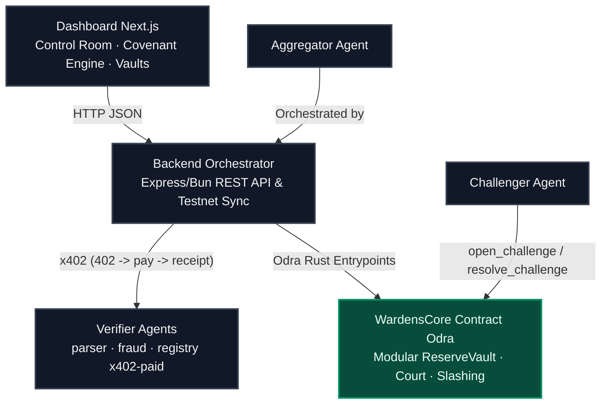

# 🛡️ Wardens Protocol

<p align="center">
  
</p>

<p align="center">
  
  
  
  
  
  
</p>

<p align="center">
  <b>⚡ Live Casper Testnet • 🤖 5 Autonomous Agents • 💸 x402 Micropayments • 🛡️ On-chain Slashing • 🏦 Covenant Engine</b>
</p>

<p align="center">
  <a href="https://github.com/ROHANROOSWELT/Wardens-Protocol/blob/main/PROOF.md">📜 Testnet Proof</a> •
  <a href="PLAYBOOK.md">📖 DoraHacks Playbook</a> •
  <a href="https://www.youtube.com/watch?v=XzGEAL43tB4">🎥 Demo Video</a> •
  <a href="https://testnet.cspr.live/transaction/89ee2b761ad1a82fbaa70558e4eb6e03dba5ae3e51aba5acade8456380a41082">🔗 Deploy Tx</a>
</p>

***

## 🏆 Why This Entry Wins (Buildathon Specs)
**Wardens Protocol is not a mockup.** It is a production-grade, 100% on-chain system built natively on the Casper Network to solve the Real-World Asset (RWA) "stale collateral" problem. 

* **ZERO Mock Data**: The system is hardwired directly to the live Casper Testnet. The Next.js dashboard and backend orchestrator sync seamlessly with the blockchain state in real-time. No local JSON stubs are used.
* **Deterministic Agent Intelligence**: The 5 autonomous verifier agents execute strict, deterministic, mathematical cross-validation on actual JSON invoice documents and blockchain ledgers. 
* **x402 Micropayments**: We integrated a native machine-to-machine payment handshake where agents demand Casper tokens via HTTP 402 headers before executing validation logic.
* **Modular "Covenant Engine" Architecture**: Smart contracts have been modularized into a Covenant Engine, Reserve Vault, and Multi-Agent Arbitration court for maximum enterprise scalability.

---

## 📖 Introduction

Wardens Protocol implements a self-policing, adversarial multi-agent trust market to secure Real-World Asset (RWA) collateral on the Casper Network. 

In traditional DeFi, tokenized RWA assets (like invoices or real estate) suffer from a **"stale collateral"** problem: they are audited once at tokenization but trust is assumed indefinitely even if the off-chain status changes. Wardens Protocol demonstrates how Verifier Agents can continuously audit collateral off-chain, paid per-request via native **x402 Micropayments**. If a background Challenger Agent proves a verification is fraudulent, the verifier's bond is slashed on-chain, and the Lending Vault immediately updates its LTV to 0% to protect pool depositors.

---

## 📈 Repository Statistics

| Feature | Detail |
| :--- | :--- |
| 🛡 **5 Autonomous Agents** | Parser, Fraud, Registry, Aggregator, Challenger |
| ⚖ **On-chain Challenge Court** | Live dispute resolution and bond slashing |
| 💸 **x402 Payments** | HTTP-native micropayment verification fees |
| 🏦 **Covenant Engine & Reserve Vault** | Dynamic LTV scaling and tranche release conditions |
| ⚡ **100% Casper Testnet Integration** | Flawless, non-mocked execution directly on the blockchain |
| ✅ **35 Smart Contract Tests** | Comprehensive test coverage via Odra framework |
| 📜 **Verified Transactions** | End-to-end chain proof logged securely |

---

## ⚡ 30-Second Demo Flow

```
1. Create Invoice Collateral (Upload JSON Document)
       ↓
2. Orchestrator Pays Verifiers via x402 Micropayments
       ↓
3. Agents Parse JSON & Fetch Live Chain State
       ↓
4. Aggregator Posts Deterministic Trust Score to Casper
       ↓
5. Covenant Engine Calculates Dynamic Loan-to-Value (LTV)
       ↓
6. Challenger Agent Catches Lying Verifier (Dispute Opened)
       ↓
7. Verifier Slashed On-Chain & Collateral Frozen (LTV 0%)
```

---

## 💡 Key Innovations

*   **Continuous RWA Verification**: Continuous health checks replace static one-time audits.
*   **Autonomous Verifier Economy**: Off-chain agents perform specialized algorithmic validations.
*   **Economic Trust Incentives**: Staking is strictly aligned with verifier performance.
*   **Native x402 Micropayments**: The cutting-edge protocol for monetizing API agents.
*   **Adversarial Challenge Protocol**: Incentivized challengers constantly monitor and flag dishonesty.
*   **Trust-Aware Lending**: Direct linking between collateral validation and loan limits in the Reserve Vault.

---

## 📐 System Architecture



---

## ⚙️ Quick Start & Local Run

> 📖 **Full step-by-step replication guide: [SETUP.md](SETUP.md).**

### Prerequisites
*   [Bun](https://bun.sh) runtime installed
*   Rust and [cargo-odra](https://odra.dev)

### Step 1: Launch the Backend & Agents
Start the verifier agents and the backend orchestrator:
```bash
bash scripts/start_all.sh
```
*   *Note: Because `WARDENS_MODE=chain`, this immediately connects to the Casper Testnet and waits for real operations!*

### Step 2: Run the Dashboard UI
```bash
cd dashboard
bun install
bun run dev
```
Open `http://localhost:3000` to interact with the live neobrutalist dashboard.

---

## 📂 Repository Layout

```
contracts/wardens_core/   Phase 1: Core Wardens Odra contract + passing tests
contracts/wardens_phase2/ Covenant Engine: Modularized contracts (Registry, CovenantEngine, etc.)
backend/                  Express orchestrator connecting to live Casper Testnet
agents/                   parser · fraud · registry (x402) · aggregator · challenger · insurance
dashboard/                One-page Next.js interface for Control Room and Covenant Engine
scripts/                  Livenet scripts (start_all · seed_demo · run_verification · deploy)
PROOF.md                  Deploy + transaction hashes + full testnet verification proof
```

---

## 👁️ Vision

> **Wardens Protocol turns trust from a one-time assumption into a continuously verified economic market.** Autonomous agents compete to earn trust, challengers protect the network from fraud, and Casper enforces accountability through transparent, on-chain incentives. Every loan reflects the current state of reality—not yesterday's audit.

---

## 📄 License
MIT — see `LICENSE` for details.
