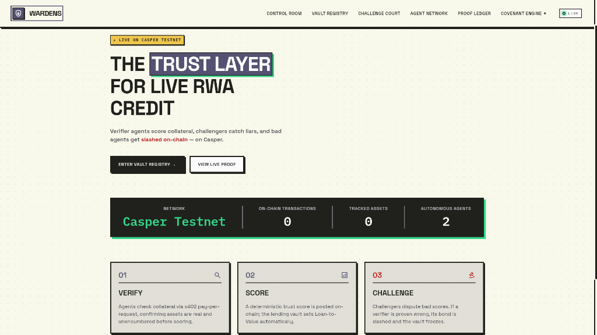
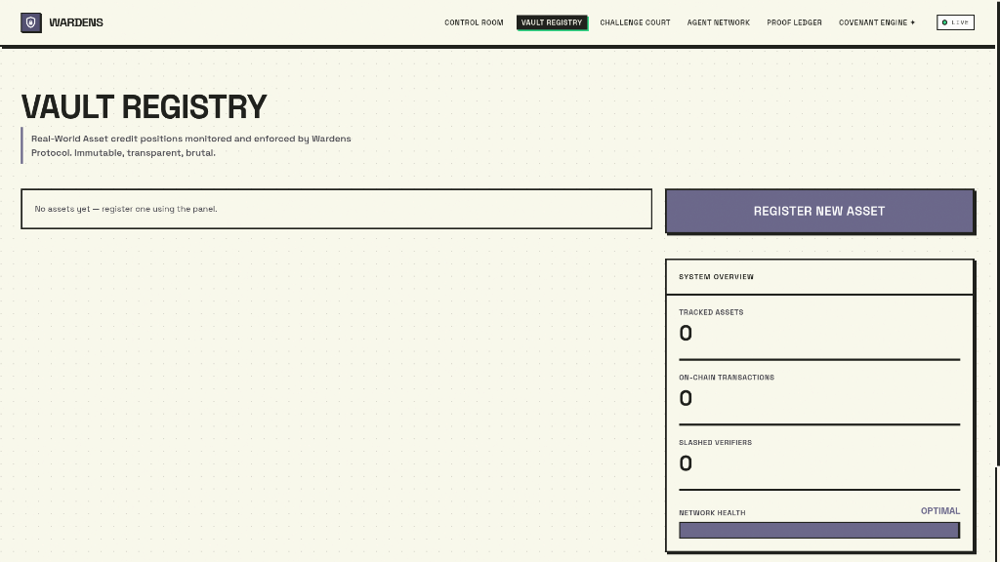
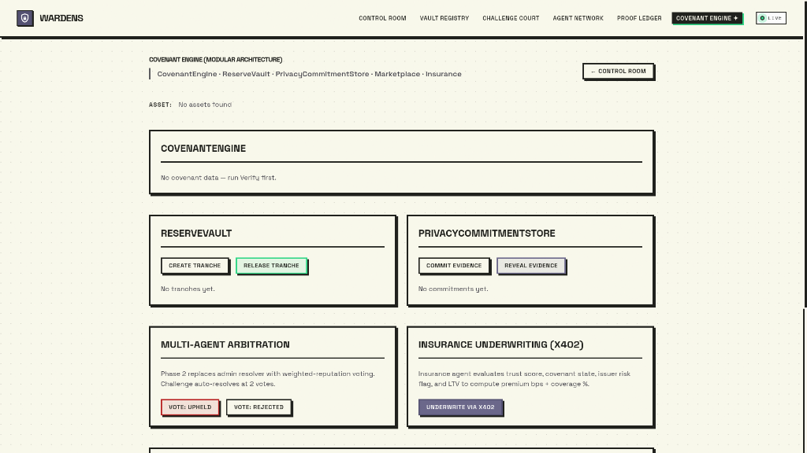
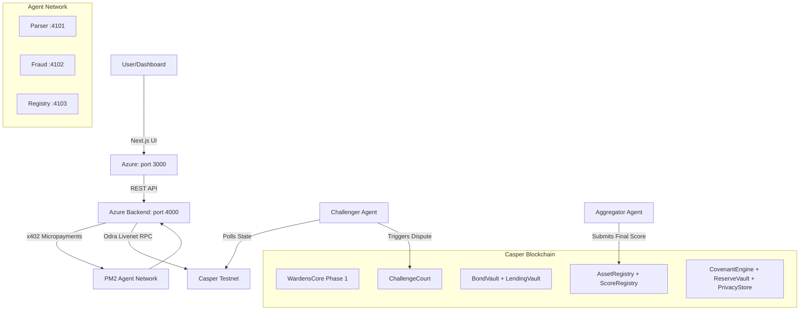

<div align="center">
  
  
  # Wardens Protocol
  
  <b>⚡ Trust should be continuously earned—not permanently assumed. ⚡</b>
  
  
  
  <br /><br />
  
  
  
  
  
  
  

  <br />

  <a href="http://20.6.128.197">🚀 Live App (Azure)</a> •
  <a href="https://wardens-protocol.vercel.app">🌍 Vercel Mirror</a> •
  <a href="https://github.com/ROHANROOSWELT/Wardens-Protocol/blob/main/PROOF.md">📜 Testnet Proof</a> •
  <a href="https://www.youtube.com/watch?v=XzGEAL43tB4">🎥 Demo Video</a>
</div>

---

## 📑 Table of Contents
- [Protocol Statistics](#-protocol-statistics)
- [Why Wardens Protocol Matters](#-why-wardens-protocol-matters)
- [Why Casper?](#-why-casper)
- [Quick Demo Flow](#-quick-demo-flow)
- [System Architecture](#-system-architecture)
- [Smart Contract Architecture](#-smart-contract-architecture)
- [The Autonomous Agent Network](#-the-autonomous-agent-network)
- [x402 Payment Flow](#-x402-payment-flow)
- [Live Testnet Deployed Contracts](#-live-testnet-deployed-contracts)
- [On-Chain Proof](#-on-chain-proof)
- [Installation & Local Setup](#️-installation--local-setup)
- [Next Milestones](#-next-milestones)

---

## 📊 Protocol Statistics

| Metric | Value |
|:---|:---|
| Smart Contracts | **9** (1 Phase 1 + 8 Phase 2 modular) |
| Autonomous Agents | **5** (Parser, Fraud, Registry, Aggregator, Challenger) |
| On-Chain Scoring | **100%** — no mocked state |
| Casper Testnet Deployments | **9 verified contract packages** |
| Hosting | **Azure VM** (backend + agents) + **Vercel** (frontend mirror) |
| Payment Protocol | **x402** micropayments between agents |
| Smart Contract Language | **Rust + Odra Framework** |

---

## 💡 Why Wardens Protocol Matters

Traditional Real-World Asset (RWA) lending assumes collateral remains trustworthy after onboarding. If a physical asset degrades or an invoice defaults weeks later, the smart contract has no idea. **The collateral becomes stale, creating systemic risk.**

Wardens replaces that assumption with a **decentralized verification economy** where agents continuously monitor assets, challenge dishonest reports, and enforce protocol rules entirely on-chain. Instead of trusting one oracle forever, the protocol creates economic incentives for truthful verification in real-time.

---

## 🔴 Why Casper?

Wardens requires deterministic execution, upgradeable contracts, predictable gas, and modular protocol evolution.

Casper's upgradeable contract packages, the Odra framework, and native contract versioning allow our Covenant Engine modules to evolve independently while preserving critical on-chain state. It is the perfect layer-1 for an enterprise-grade trust protocol.

---

## 🚀 Quick Demo Flow

<div align="center">
  
  <br /><br />
  
  <br /><br />
  
</div>

1. **Register Invoice:** Submit asset metadata to the Vault Registry. A real Casper deploy fires via `WardensCore.create_asset`.
2. **Agents Verify:** The backend pays Parser, Fraud, and Registry agents via **x402 micropayments** to independently score the asset.
3. **Score Submitted:** The Aggregator Agent drops outliers and posts the final Trust Score (0–100) to the `ScoreRegistry` contract on-chain.
4. **Challenge Opens:** The Challenger Agent polls the blockchain. If a high score looks fraudulent, it posts a counter-bond to `ChallengeCourt`.
5. **Arbitration Vote:** Bonded agents vote on-chain. Quorum of 2 resolves the dispute.
6. **Slash & Freeze:** The dishonest verifier's bond is slashed by `BondVault`. The asset's LTV drops to 0% via `CovenantEngine`, freezing further borrowing.

---

## 🏛️ System Architecture



---

## 📜 Smart Contract Architecture

Built using the **Odra Framework**, we modularized the protocol into 9 upgradeable contracts:

- **WardensCore (Phase 1):** Monolithic trust-scoring contract. Handles asset creation, agent registration, score submission, and challenge/slash resolution.
- **AssetRegistry & ScoreRegistry:** Tokenizes RWA metadata and stores the immutable ledger of agent-submitted trust scores.
- **BondVault & LendingVault:** Escrows CSPR agent stakes and algorithmically enforces DeFi LTV limits based on Trust Scores.
- **ChallengeCourt:** Handles multi-agent voting arbitration and on-chain dispute resolutions.
- **CovenantEngine & ReserveVault:** A programmatic rule-engine assigning compliance states (`FullAccess`, `Monitored`, `DrawsFrozen`, `BreachMode`) and managing locked capital tranches.
- **PrivacyStore:** A Merklized data registry for zero-knowledge evidence commitments — stores only the Merkle root, never raw invoice data.

---

## 🤖 The Autonomous Agent Network

Our network of deterministic verifier agents operates as independent microservices via **PM2 on Azure**. Internal data-fetchers run off-chain for gas efficiency; only public actors lock cryptographic bonds on Casper.

| Agent | Port | Role |
|:---|:---|:---|
| **Parser** | 4101 | Parses JSON invoice structure and validates field completeness |
| **Fraud** | 4102 | Scans blockchain state for duplicate collateral hashes |
| **Registry** | 4103 | Runs heuristic credit checks on debtor/issuer credentials |
| **Aggregator** | CLI | Collects scores, drops outliers, submits finalized Trust Score on-chain |
| **Challenger** | CLI | Polls blockchain; opens `ChallengeCourt` dispute if fraud detected |

---

## 💸 x402 Payment Flow

Every verification call is gated by an **HTTP 402 Payment Required** micropayment. The backend acts as the x402 client; each agent is the paywall.

```
Backend → POST /verify/fraud
        ← 402 Payment Required  { price: "1000000 motes", payTo: "casper-fraud-agent-wallet" }
Backend → POST /verify/fraud + X-Payment header (signed receipt)
        ← 200 OK { score: 95, valid: true, findings: [...] }
```

This creates a **real economic cost** for verification — preventing spam, aligning agent incentives, and demonstrating x402 on Casper for the first time.

---

## 🔗 Live Testnet Deployed Contracts

<details>
<summary><b>Click to view all 9 Casper Testnet Contract Packages</b></summary>
<br>

| Module | Casper Testnet Contract Package |
| :--- | :--- |
| **WardensCore (Phase 1)** | [`contract-package-b93d38...`](https://testnet.cspr.live/contract-package/b93d38aa5cacb4b9ecae17ebb7364b906abba449bda9396775e2f674a1fa3c2f) |
| **AssetRegistry** | [`contract-package-8c6e8f...`](https://testnet.cspr.live/contract-package/8c6e8f1c799d4abc596973d612492e5b5b03643247d0af27a0db363f7e360320) |
| **ScoreRegistry** | [`contract-package-3afb41...`](https://testnet.cspr.live/contract-package/3afb414e8f2f2e2c1db569945dc34fa6705bb5efa3c945c7d37856bff7682590) |
| **BondVault** | [`contract-package-249f59...`](https://testnet.cspr.live/contract-package/249f599014a2167dab598362451b4c7b591884b7a9e5f3e65f4f31a5e4783f38) |
| **ChallengeCourt** | [`contract-package-83afda...`](https://testnet.cspr.live/contract-package/83afda159a1e580ccf4baf2144a06a9f753df0db46b5b019e1fe061098f43f27) |
| **LendingVault** | [`contract-package-9b83b0...`](https://testnet.cspr.live/contract-package/9b83b046e8749359f1cf096420ff5b029cec12777173ab891aa64d00a736bb09) |
| **CovenantEngine** | [`contract-package-8b3f40...`](https://testnet.cspr.live/contract-package/8b3f4001f64a30028bccb919cf9f235bc2b3ff2fc642683d6c799b5d2fbab50e) |
| **ReserveVault** | [`contract-package-c64d65...`](https://testnet.cspr.live/contract-package/c64d65803aa4975709d88f8a039d0b082cb7fed8d000b551a09806424ab08c2f) |
| **PrivacyStore** | [`contract-package-ac2adf...`](https://testnet.cspr.live/contract-package/ac2adf6c0770d2ca1ac44bf197469ee23735587c28507f4eb6ce98743ebb9497) |

</details>

---

## ✅ On-Chain Proof

These are real `create_asset` transactions submitted live to the Casper Testnet from the Azure backend:

| Asset | Transaction Hash |
|:---|:---|
| INV-1784902786636-3000 | [`7a0e77e4...`](https://testnet.cspr.live/transaction/7a0e77e46efa55c94da5aeb3d293e62834d6c5494892ff0104a3ba5e274cf2e3) |
| INV-1784902872589-7137 | [`fa37c004...`](https://testnet.cspr.live/transaction/fa37c004346a58fb3d6d46356f9b4419ee0d2bd7bf32967b4dad817dbbc867d0) |
| INV-1784902938289-2917 | [`161e71e4...`](https://testnet.cspr.live/transaction/161e71e446aa7d525716701f3cdd63339b06ec865baee3e0b9ea597896b5ee47) |

> All transactions are verifiable on [testnet.cspr.live](https://testnet.cspr.live). The backend runs in `WARDENS_MODE=chain` — zero simulation.

---

## 📂 Repository Structure

```text
├── agents/                 # Autonomous microservices (Parser, Fraud, Registry, Aggregator, Challenger)
├── backend/                # Express.js orchestrator + x402 client
├── contracts/
│   ├── wardens_core/       # Phase 1 monolithic contract (Rust + Odra)
│   └── wardens_phase2/     # Phase 2 modular contracts (8 contracts)
├── dashboard/              # Next.js 15 frontend
├── docs/                   # Screenshots, logo, demo GIF
├── scripts/                # Azure deployment + PM2 orchestration
└── README.md
```

---

## 🛠️ Installation & Local Setup

### 1. Clone & Build Contracts
*Requires Rust and Cargo.*
```bash
git clone https://github.com/ROHANROOSWELT/Wardens-Protocol.git
cd Wardens-Protocol/contracts/wardens_core
cargo build --release --features livenet --bin wardens_livenet

cd ../wardens_phase2
cargo build --release --features livenet --bin wardens_phase2_livenet
```

### 2. Configure Environment
```bash
cd ../../backend
cp .env.example .env
# Fill in: CASPER_NODE_URL, WARDENS_CORE_ADDRESS (contract-package-... format), BACKEND_PRIVATE_KEY_PATH
```

### 3. Start the Backend and Agents
*Requires [Bun](https://bun.sh/) and [PM2](https://pm2.keymetrics.io/).*
```bash
# Install dependencies
cd ../backend && bun install
cd ../agents/parser-agent && bun install
cd ../agents/fraud-agent && bun install
cd ../agents/registry-agent && bun install

# Start all services
cd ../..
pm2 start ecosystem.config.js
pm2 save
```

### 4. Run the Dashboard
```bash
cd dashboard
bun install
bun run dev
# → http://localhost:3000
```

### 5. One-Command Azure Deploy
```bash
# Deploys everything to Azure VM in one shot
./scripts/deploy_azure.sh
```

---

## 🗺️ Next Milestones

- 🌐 **Mainnet** — Deploying the Covenant Engine to Casper Mainnet.
- 🔐 **ZK Evidence** — Zero-Knowledge proofs for private invoice verification.
- 🏛️ **DAO Governance** — Decentralized updates for Covenant Engine rules via on-chain voting.
- 🌉 **Cross-chain Verification** — Bridging asset trust states across EVM and Casper.
- 📱 **Mobile Dashboard** — Real-time asset monitoring via PWA.

---

## 📄 License
MIT — see `LICENSE` for details.
