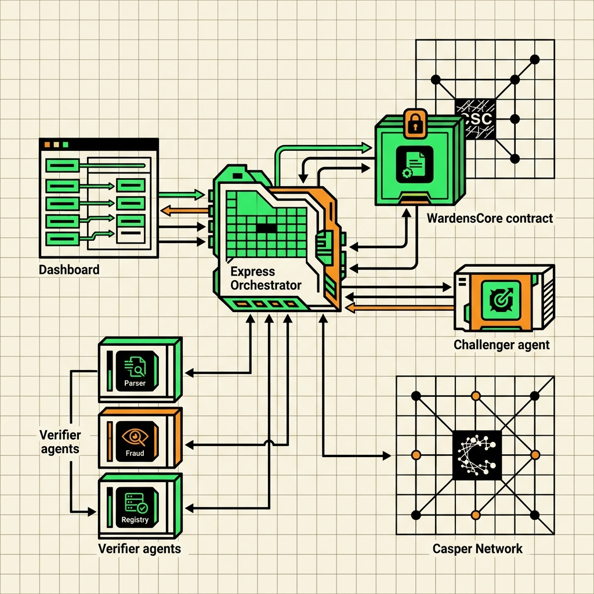
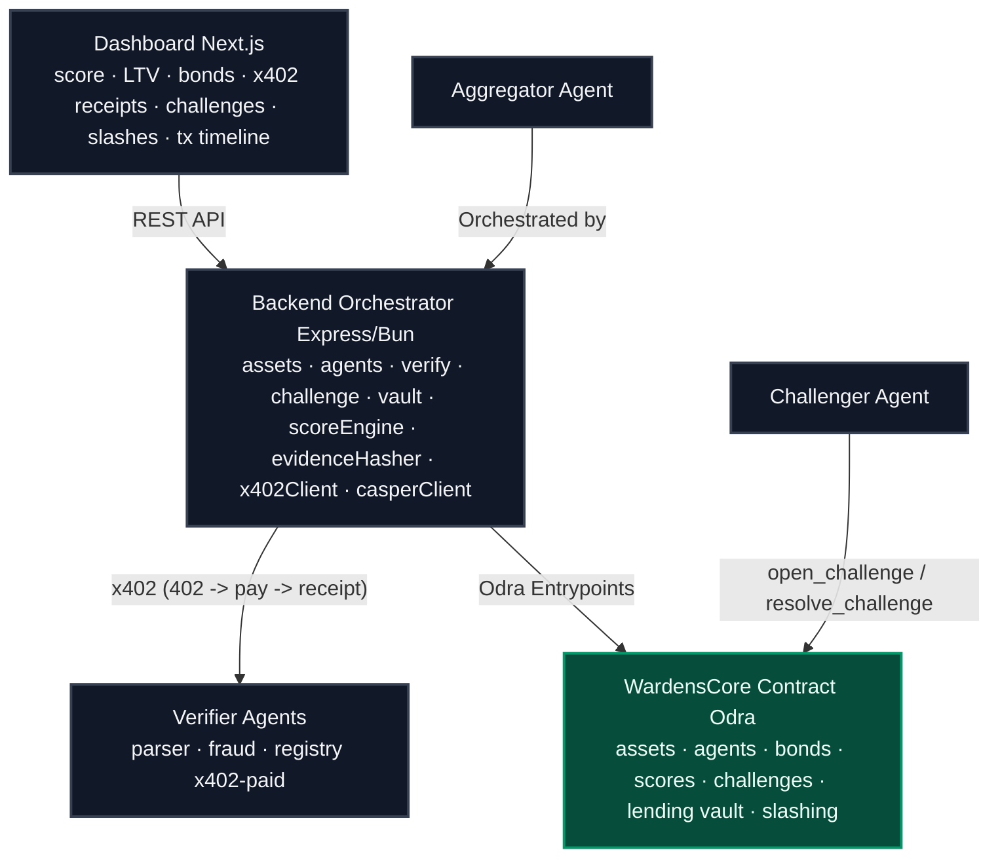

# Wardens Protocol

<p align="center">
  
</p>

<p align="center">
  
</p>

<p align="center">
  
  
  
  
  
  
</p>

<p align="center">
  ⚡ Live Casper Testnet • 🤖 5 Autonomous Agents • 💸 x402 Micropayments • 🛡️ On-chain Slashing • 🏦 Dynamic RWA Lending
</p>

<p align="center">
  <a href="https://github.com/ROHANROOSWELT/Wardens-Protocol/blob/main/PROOF.md">📜 Testnet Proof</a> •
  <a href="https://testnet.cspr.live/transaction/89ee2b761ad1a82fbaa70558e4eb6e03dba5ae3e51aba5acade8456380a41082">🔗 Deploy Tx</a> •
  <a href="https://testnet.cspr.live/contract-package/ef137b674026c1c08e55fc16e7d9e0dac9eec6b1a96b9f0b54b8fc729a9874de">🔗 Casper Explorer</a>
</p>

***

## Introduction

Wardens Protocol implements a self-policing, adversarial multi-agent trust market to secure Real-World Asset (RWA) collateral on the Casper Network. 

In traditional DeFi, tokenized RWA assets (like invoices or real estate) suffer from a **"stale collateral"** problem: they are audited once at tokenization but trust is assumed indefinitely even if the off-chain status changes. Wardens Protocol demonstrates how Verifier Agents can continuously audit collateral off-chain, paid per-request via native **x402 Micropayments**. If a background Challenger Agent proves a verification is fraudulent, the verifier's bond is slashed on-chain, and the Lending Vault immediately updates its LTV to 0% to protect pool depositors.

---

## Why It Matters

Current RWA protocols trust collateral based on one-time verification.

Wardens Protocol introduces continuous verification through an adversarial market of autonomous agents.

Instead of assuming trust, the protocol continuously earns it.

This transforms collateral from static trust into continuously verified trust.

---

## Why Casper?

Wardens Protocol relies on Casper to provide economically secure, upgradeable trust infrastructure for Real-World Assets.

Casper enables:
*   **Native On-chain Staking and Slashing**: Enforces verifier accountability with immutable bond locking.
*   **Upgradeable Smart Contracts via Odra**: Allows the protocol to adapt to evolving RWA standards.
*   **Deterministic Execution**: Ensures predictable outcomes for critical financial credit state transitions.
*   **Transparent, Auditable Verification History**: Builds a public log of verifications, disputes, and resolutions.
*   **Secure Settlement**: Safely settles trust score updates and lending status updates.

These capabilities make Casper the trust layer that continuously secures RWA collateral throughout its lifecycle.

---

## 📈 Repository Statistics

| Feature | Detail |
| :--- | :--- |
| 🛡 **5 Autonomous Agents** | Parser, Fraud, Registry, Aggregator, Challenger |
| ⚖ **On-chain Challenge Court** | Live dispute resolution and bond slashing |
| 💸 **x402 Payments** | HTTP-native micropayment verification fees |
| 🏦 **Dynamic Lending Vault** | Dynamic LTV adjustments responding to collateral health |
| ⚡ **Casper Testnet Deployment** | Live execution and transaction trail |
| ✅ **12 Smart Contract Tests** | Comprehensive contract unit test coverage |
| 📜 **Verified Transactions** | End-to-end chain proof logged |
| 🖥 **Interactive Dashboard** | Real-time neobrutalist monitoring console |

---

## ⚡ 30-Second Demo Flow

```
Create Invoice Collateral
       ↓
Run Verification Request
       ↓
Orchestrator Pays Verifiers via x402
       ↓
Post Aggregated Trust Score to Casper
       ↓
Borrow Against Healthy Invoice (LTV 75%)
       ↓
Challenger Agent Catches Lying Verifier
       ↓
Dispute Resolved on Casper
       ↓
Verifier Slashed & Collateral Frozen (LTV 0%)
```

---

## 📸 Dashboard Screenshots

### Active Challenge Court
*Live Challenge Court page displaying active disputes, verifier/challenger agents involved, and on-chain action buttons:*


### Frozen Collateral State
*Dashboard displaying the frozen status of an asset after a fraudulent score has been successfully slashed:*


---

## 📋 Features

*   **✅ Casper Testnet Deployment**: Deployed on `casper-test` network.
*   **✅ Odra Smart Contract**: Built with the Rust Odra contract framework.
*   **✅ x402 Micropayments**: Complete HTTP-native micropayment handshake.
*   **✅ Autonomous Verifiers**: Parser, Fraud, and Registry agents.
*   **✅ Challenger Agent**: Autonomous background monitoring loop.
*   **✅ Dynamic Lending Vault**: On-chain LTV scaling state machine.
*   **✅ Bond Slashing**: On-chain economic penalty logic.
*   **✅ Interactive Dashboard**: Clean, responsive frontend rendering state.
*   **✅ Transaction Proofs**: Auditable testnet logs in `PROOF.md`.

---

## 💡 Key Innovations

*   **Continuous RWA Verification**: Continuous health checks replace static audits.
*   **Autonomous Verifier Economy**: Off-chain agents perform specialized validations.
*   **Economic Trust Incentives**: Staking aligned with verifier performance.
*   **Native x402 Micropayments**: Native payment handshakes for execution.
*   **Dynamic Collateral Valuation**: Real-time adjustment of credit capacity (LTV).
*   **Adversarial Challenge Protocol**: Incentivized challengers monitor and flag dishonesty.
*   **On-chain Slashing**: Casper smart contract penalty enforcement.
*   **Trust-Aware Lending**: Direct linking between collateral validation and loan limits.

---

## 🛡️ Security Model

Wardens Protocol aligns incentives through economic penalties:

```
Verifier Submits Score
       ↓
Verifier Bond Locked
       ↓
Challenge Window Opens
       ↓
Evidence Reviewed (by Challenger)
       ↓
Honest → Reward Issued
Dishonest → Slash Bond
       ↓
Vault Updates Collateral Status
```

---

## ⚖️ Protocol Guarantees

Wardens Protocol guarantees that:

*   **✓ Every trust score is attributable** to the verifier who signed it.
*   **✓ Every verifier stakes collateral** (bond) before posting scores.
*   **✓ Every dispute is auditable** transparently on-chain.
*   **✓ Every slash is executed on-chain** based on verified evidence.
*   **✓ Every lending decision reflects the latest verified state** of the collateral.

---

## 📐 System Architecture





> ℹ️ *Detailed verification and slashing sequence diagrams can be viewed in [docs/sequence_diagrams.md](docs/sequence_diagrams.md).*

---

## 🟢 Protocol Implementation Matrix

| Component | Technical Implementation | Details |
| :--- | :--- | :--- |
| **Smart Contracts (1x)** | `Odra Rust WASM` | Unified `WardensCore` contract (compiles to target WASM with access controls). Implements `create_asset`, `register_agent`, `post_bond`, `submit_score`, `open_challenge`, and `resolve_challenge` entry points. **12/12 passing unit tests**. |
| **Verifier Agents (3x)** | `Express/Bun HTTP Daemons` | Parser, Fraud-Heuristic, and Registry agents performing deterministic evaluation metrics (issuer valid, duplicate invoice detection, and payment check). |
| **x402 Micropayments** | `HTTP 402 + X-Payment Handshake` | Client-side and server-side payment checking. Handles HTTP 402 retry headers and verifies on-chain transaction hashes to generate cryptographic receipt logs. |
| **Dispute & Slashing** | `Adversarial Challenger Agent` | Autonomous background monitoring service. Cross-checks on-chain trust scores against raw invoice ledgers, submits disputes, and slashes bonds on-chain. |
| **DeFi Lending Vault** | `Dynamic LTV Scale Machine` | On-chain vault responding to score updates: Score >= 80 maps to 75% LTV; Score < 50 triggers frozen state (0% LTV). |
| **Testnet Deployment** | `secp256k1 Signed transactions` | Verified, real-time transaction trail confirmed and finalized on Casper Testnet using ECDSA/SHA256 signing. |
| **Dashboard UI** | `Next.js, TypeScript, & Tailwind` | Real-time state polling via JSON-RPC, rendering score updates, LTV, active verifier bonds, payment receipts, and explorer logs. |

---

## 🔗 Casper Testnet Deployment

The protocol contracts and demo operations are deployed and active on the Casper Testnet
(`casper-test`, Casper 2.0). Every hash is a real transaction — verify at
`https://testnet.cspr.live/transaction/<hash>`. Full list in [PROOF.md](PROOF.md).

*   **Contract Package Hash**: `contract-package-ef137b674026c1c08e55fc16e7d9e0dac9eec6b1a96b9f0b54b8fc729a9874de`
*   **Deploy WardensCore**: `89ee2b761ad1a82fbaa70558e4eb6e03dba5ae3e51aba5acade8456380a41082`

### Transaction Log

| Operation | Transaction Hash | Result |
| :--- | :--- | :--- |
| **Create INV-001** | `92a7e961f6c6574c49101fda09c44a806f112b66f76fe207660f2505a716d463` | Collateral asset created |
| **Register Aggregator** | `3d738485db86736c4b2c31f2109ef4782b7a034a218cb9ea740328574dac3ea3` | Verifier registered |
| **Register Challenger** | `0dea2958d32ccc24143dbb67db40f3daf656b721724c07d20fa94408250181b3` | Challenger registered |
| **Post Agent Bond** | `76ea896f7881db97c527e71c6b33bb0b5bfd8d53b0bc7d8e88a4e5eb3e96ba8c` | 10 CSPR stake locked |
| **Submit Trust Score** | `c5b269f22bf8e8f8c0467aa84daeb6bfbc9ed8ff2ad8ef2e99dff38c912a7038` | Trust Score 94 posted (LTV 75%) |
| **Borrow CSPR** | `ce7d6499f531eb08671f1d76641a1768d64dcb5c1aa68d34273a5af2a1f02308` | 700 CSPR loan authorized |
| **Submit Fraud Score** | `503620b136d3d6b234f634573fe1302f28a93b0f7c0d0f5aaa895ec0a426334c` | INV-002 score 46 / LTV to 0% (frozen) |
| **Open Challenge** | `dfc4085365b27ac843342afa6dba9c48718a709f95e233941838e05e0ab57014` | Dispute opened with bond |
| **Resolve Challenge** | `f9231526dba6869087b08cf5f53fc87d9d1f93bb1d5cbbaef9f48c7b42da8687` | Verifier slashed, Challenger rewarded, INV-003 frozen |

---

## ⚙️ Quick Start & Local Run

> 📖 **Full step-by-step replication guide (local, custom agents, and testnet deploy): [SETUP.md](SETUP.md).**

### Prerequisites
*   [Bun](https://bun.sh)
*   Rust and [cargo-odra](https://odra.dev)

### Step 1: Run the Smart Contract Test Suite
Ensure the smart contract is compiling and all 12 core tests pass:
```bash
cd contracts/wardens_core
cargo odra test
```

### Step 2: Launch the Ecosystem
Start the verifier agents and the backend orchestrator:
```bash
cd ../..
bash scripts/start_all.sh
```
*   Backend orchestrator starts on `http://localhost:4000`
*   Agents listen on ports `4101-4103`

### Step 3: Run the On-Chain Demo Scripts
Simulate the entire end-to-end game loop:
```bash
# Seed the assets and register agents
bash scripts/seed_demo.sh

# Run verifications (INV-001 -> healthy, INV-002-DUPLICATE -> frozen)
bash scripts/run_verification.sh

# Run the challenge and slash sequence (INV-003 -> challenged -> verifier slashed)
bash scripts/run_challenge.sh
```

### Step 4: Run the Dashboard UI
```bash
cd dashboard
bun install
bun run dev
```
Open `http://localhost:3000` to interact with the live dashboard.

---

## 📂 Repository Layout

```
contracts/wardens_core/   Unified WardensCore Odra contract + 12 passing tests
backend/                  Express orchestrator (assets/agents/verify/challenge/vault)
agents/                   parser · fraud · registry (x402 verifiers) · aggregator · challenger
dashboard/                One-page Next.js dashboard
scripts/                  start_all · seed_demo · run_verification · run_challenge · deploy
docs/                     [demo-script](docs/demo-script.md) · [contract-api](docs/contract-api.md) · [agent-api](docs/agent-api.md) · [roadmap](docs/roadmap.md)
PROOF.md                  Deploy + transaction hashes
accounts.md               Testnet wallet public keys
```

---

## 🗺️ Roadmap

The long-term development strategy and target specifications are fully documented in [docs/roadmap.md](docs/roadmap.md). 

This includes:
*   Modular smart contract split (`AssetRegistry`, `TrustScoreRegistry`, `ChallengeCourt`, etc.).
*   Integration of a `CovenantEngine` for tranche release rules.
*   Merklized `PrivacyCommitmentStore` for zero-disclosure evidence checking.

---

## 🛡️ What This Repository Demonstrates

*   **✓ Casper smart contract** deployed to Testnet
*   **✓ Real transaction history** mapped on-chain
*   **✓ Autonomous verifier agents** checking RWA status
*   **✓ x402 payment protocol** live verification gating
*   **✓ Dynamic lending vault** reacting to collateral scores
*   **✓ On-chain dispute resolution** via the Challenge Court
*   **✓ Bond slashing** for fraudulent reports
*   **✓ Interactive dashboard** neobrutalist client
*   **✓ Complete end-to-end** protocol demonstration

---

## 👁️ Vision

> Wardens Protocol turns trust from a one-time assumption into a continuously verified economic market. Autonomous agents compete to earn trust, challengers protect the network from fraud, and Casper enforces accountability through transparent, on-chain incentives. Every loan reflects the current state of reality—not yesterday's audit.

---

## 📄 License

MIT — see `LICENSE` for details.
