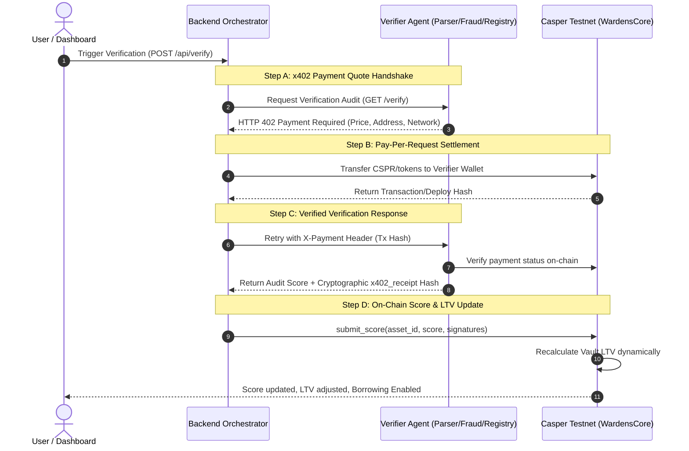
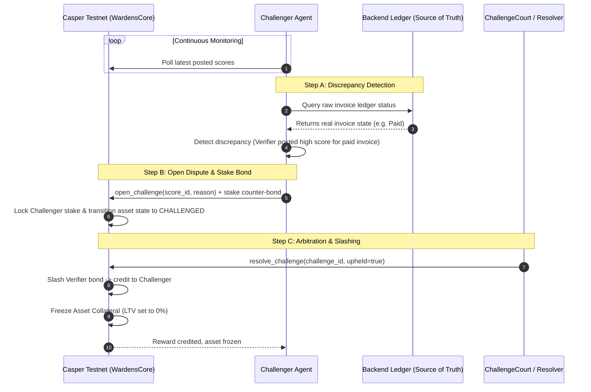

# Wardens Protocol — Technical Sequence Diagrams

This document contains the detailed step-by-step sequence diagrams illustrating the core interaction flows in the Wardens Protocol network.

## 1. Verification & x402 Micropayment Handshake

The verification flow leverages the Casper AI Toolkit's HTTP-native micropayment design to enable automated machine-to-machine settlements:

---

## 2. Challenger & Slashing Flow

The Challenger Agent runs continuously as a background auditing service, enforcing compliance on-chain through game-theoretic incentives:

